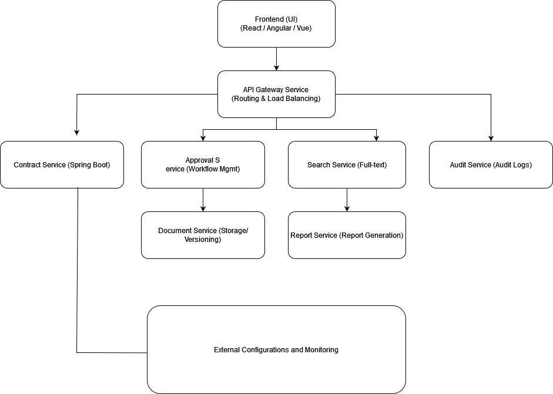

# System Architecture Overview

## Objective

The Contract Management System (CMS) is a distributed application built using microservices architecture. It is designed to allow the creation, storage, and management of contracts in a secure and scalable way. The system utilizes a MongoDB database to store contract details and uses a Spring Boot-based microservices approach for modularity.

## Architecture Diagram

The following diagram illustrates the architecture of the Contract Management System:

## Component Design

The Contract Management System is broken into multiple components to ensure separation of concerns, scalability, and maintainability.

### Key Components

#### **Contract Service**
- **Responsibilities**: Manages all contract-related operations, such as creating, updating, deleting, and viewing contracts. This service provides REST endpoints and handles business logic for contract management.
- **Technology**: Spring Boot
- **Key Interfaces**: 
  - REST API endpoints (`/contracts`, `/contracts/{id}`) for CRUD operations
  - Integration with Document Service for contract-related document storage and retrieval

#### **Approval Service (Not implemented)**
- **Responsibilities**: Manages the approval workflow for contracts, ensuring that contracts go through necessary approval stages. This service tracks contract statuses and manages notifications within the system.
- **Technology**: Spring Boot
- **Key Interfaces**:
  - REST API for managing approvals (`/approvals`, `/approvals/{id}`)
  - Interface to interact with contract and document services for workflow management

#### **Frontend (UI) (Not implemented)**
- **Responsibilities**: Provides a user-friendly interface for interacting with the system, allowing users to create, update, and manage contracts. This interface also includes features for viewing approval status, uploading documents, and generating reports.
- **Technology**: React or Angular
- **Key Interfaces**:
  - Forms for contract creation, editing, and approval requests
  - List and detail views for contract management
  - Interface for interacting with reporting and document upload functionality

#### **Document Service (Not implemented)**
- **Responsibilities**: Handles document storage and versioning, allowing users to attach documents to contracts and manage document versions. This service centralizes document-related operations.
- **Technology**: Spring Boot, AWS S3 (or similar for document storage)
- **Key Interfaces**:
  - API for uploading, retrieving, and managing document versions (`/documents`, `/documents/{id}`)
  - Interface with Contract Service to provide document storage capabilities for contracts

#### **Search Service**
- **Responsibilities**: Provides advanced search functionality across contracts, allowing users to search for contracts by metadata, keywords, or specific fields.
- **Technology**: Spring Boot, Elasticsearch
- **Key Interfaces**:
  - REST API for searching (`/search?query={query}`), with support for filtering and full-text search
  - Integration with Contract Service to maintain searchable contract data

#### **Audit Service**
- **Responsibilities**: Tracks and logs user actions and events within the system to maintain a comprehensive audit trail.
- **Technology**: Spring Boot, MongoDB (or other database for log storage)
- **Key Interfaces**:
  - API to record and retrieve audit logs (`/audit`, `/audit/{id}`)
  - Interface for viewing logs from the frontend

#### **Report Service**
- **Responsibilities**: Generates reports on contracts, approvals, and other system data, offering users insights into contract status, document activities, and overall system usage.
- **Technology**: Spring Boot, JasperReports
- **Key Interfaces**:
  - API endpoints for generating and downloading reports (`/reports`, `/reports/{id}`)
  - Integration with Contract and Approval Services to gather report data

#### **API Gateway (Not implemented)**
- **Responsibilities**: Acts as the entry point for all external requests, handling request routing, load balancing, and security checks before forwarding requests to appropriate services.
- **Technology**: Spring Cloud Gateway
- **Key Interfaces**:
  - Routes requests to relevant services, manages authentication/authorization
  - Provides consolidated logging and metrics for monitoring requests

#### **Config and Discovery Services**
- **Responsibilities**:
  - **Config Service**: Provides centralized configuration management, allowing dynamic updates to configuration properties across services.
  - **Discovery Service**: Manages service registration and discovery, enabling microservices to locate each other for direct communication.
- **Technology**: Spring Cloud Config (Config Service), Eureka (Discovery Service)
- **Key Interfaces**:
  - Configuration endpoints for each service to fetch configurations
  - Service registry and discovery to allow services to connect seamlessly
