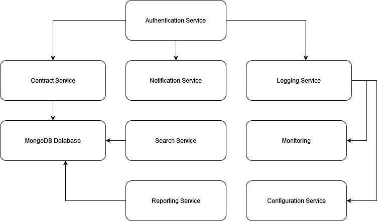

# Microservices Architecture

## Overview
The Contract Management System uses a microservices architecture, allowing services to operate independently and scale as needed. Each service has a single responsibility, and they communicate over well-defined APIs.

## Diagram



### Services:
- **Authentication Service**: Manages user login, registration, and session handling.
- **Contract Service**: Handles contract lifecycle operations.
- **Notification Service**: Sends notifications or emails to users.
- **Logging Service**: Handles logging of all actions and service statuses for auditing purposes.
- **Analytics Service**: Collects data and provides analytics or reports related to contracts.

## Service-to-Service Communication
- **REST APIs**: For communication between contract service, notification service, and other services.
- **Event-Driven**: Kafka or RabbitMQ for decoupled messaging between services (e.g., after contract creation, a notification event is published).

# Database Design

## MongoDB Collection Structure

MongoDB stores each contract as a document. The collection name is `contracts`.

## Contract Document Structure

```
{
  "_id": ObjectId("605c72ef153207001f24e6b6"), 
  "title": "Contract A",
  "partyA": "Company X",
  "partyB": "Company Y",
  "startDate": "2024-01-01T00:00:00",
  "endDate": "2025-01-01T00:00:00",
  "status": "active",  // or "expired", "draft"
  "createdDate": "2024-01-01T00:00:00",
  "updatedDate": "2024-01-02T12:00:00"
}
```

### Indexes
- **Primary Index**: `_id` (ObjectId)
- **Secondary Indexes**:
  - `title` (for searching contracts by title)
  - `status` (for querying active or expired contracts)

### Relationships
MongoDB is a NoSQL database, so we will **not** have foreign key constraints. However, we may reference users (in case we want to track which user created or modified a contract).

# REST API Design

## Contract Service API Endpoints

### Create a New Contract
- **Method**: POST
- **Endpoint**: `/contracts`
- **Request Body**: 
  ```json
  {
    "title": "Contract A",
    "partyA": "Company X",
    "partyB": "Company Y",
    "startDate": "2024-01-01",
    "endDate": "2025-01-01",
    "status": "draft"
  }
  ```
- **Response**: 
  ```json
  {
    "id": "605c72ef153207001f24e6b6",
    "title": "Contract A",
    "partyA": "Company X",
    "partyB": "Company Y",
    "startDate": "2024-01-01",
    "endDate": "2025-01-01",
    "status": "draft"
  }
  ```

### Get a Contract by ID
- **Method**: GET
- **Endpoint**: `/contracts/{id}`
- **Response**:
  ```json
  {
    "id": "605c72ef153207001f24e6b6",
    "title": "Contract A",
    "partyA": "Company X",
    "partyB": "Company Y",
    "startDate": "2024-01-01",
    "endDate": "2025-01-01",
    "status": "active"
  }
  ```

### Delete a Contract by ID
- **Method**: DELETE
- **Endpoint**: `/contracts/{id}`
- **Response**: 
  ```json
  {
    "message": "Contract deleted successfully"
  }
  ```

### Update a Contract
- **Method**: PUT
- **Endpoint**: `/contracts/{id}`
- **Request Body**:
  ```json
  {
    "title": "Updated Contract A",
    "partyA": "Company X",
    "partyB": "Company Z",
    "startDate": "2024-01-01",
    "endDate": "2025-01-01",
    "status": "active"
  }
  ```
- **Response**: 
  ```json
  {
    "id": "605c72ef153207001f24e6b6",
    "title": "Updated Contract A",
    "partyA": "Company X",
    "partyB": "Company Z",
    "startDate": "2024-01-01",
    "endDate": "2025-01-01",
    "status": "active"
  }
  ```

# Deployment Architecture

## Overview

The Contract Management System is designed to run in a cloud-native environment, such as AWS, GCP, or Azure. Each microservice can be deployed in isolated containers using Docker and orchestrated using Kubernetes.

### Communication Patterns:

- **REST APIs**: All services expose RESTful APIs for inter-service communication, especially for data operations (e.g., contract creation, updating, retrieval).
- **Event-Driven**: The **Notification Service** might listen for events (e.g., contract created, contract updated) via Kafka or RabbitMQ to decouple the communication.
- **Database**: The **Contract Service** interacts directly with the **MongoDB Database**, storing and retrieving contract data.

### Optional Scaling & Fault Tolerance Considerations:

- **Service Discovery**: Kubernetes or Consul can be used to ensure service discovery and manage communication between services.
- **Auto-scaling**: Using **Kubernetes** for auto-scaling each service based on demand.
- **Resilience**: Circuit breakers (using **Hystrix**) and retries should be considered for handling failures gracefully.
