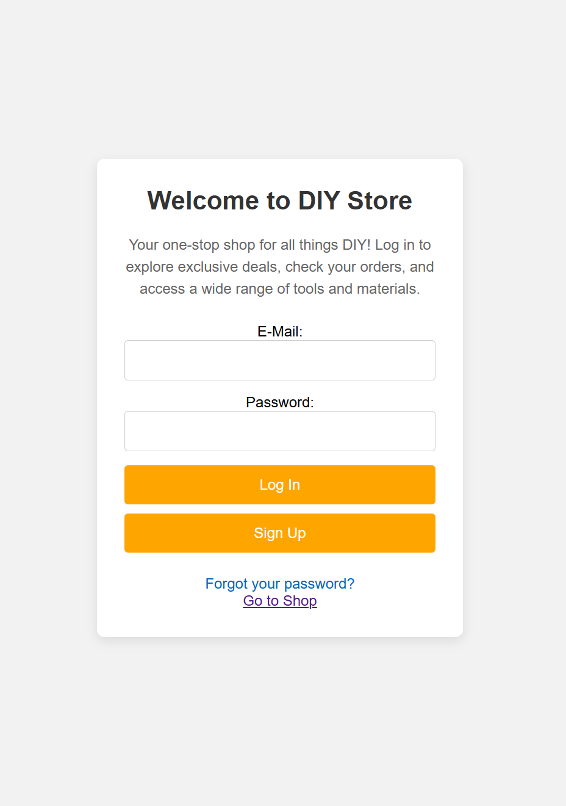
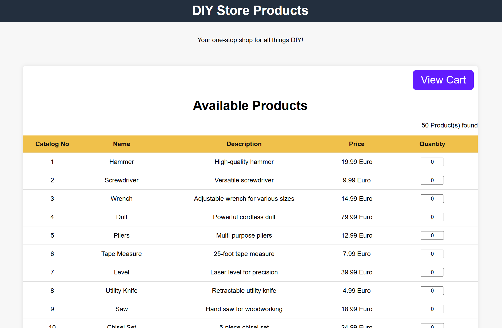
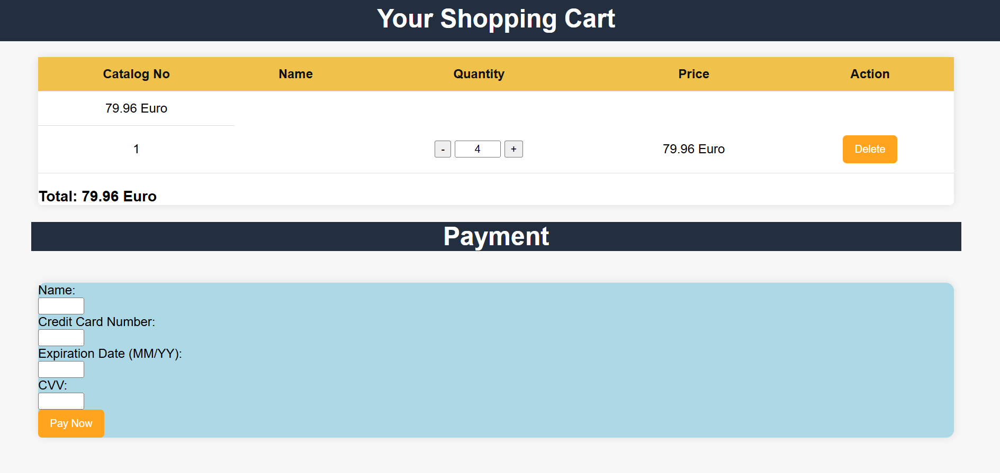

# Java E-Commerce Platform

This is a simple, yet functional e-commerce platform built using Java EE (Jakarta EE), JSP, Servlets, and JDBC. The platform allows users to browse products, manage their shopping cart, and process payments. It serves as an excellent example of how to build a small e-commerce application using Java technologies.

## Features

- **User Authentication**: Secure login system with session management.
- **Product Browsing**: List and view products available for purchase.
- **Shopping Cart Management**: Add, remove, and update product quantities in the shopping cart.
- **Payment Processing**: Simulated payment processing with success and failure redirection.
- **Session Management**: The shopping cart and user sessions are stored and handled using Java Servlet sessions.
- **Database Integration**: Product details and transaction records are stored in a relational database (e.g., MySQL).
- **User-friendly Interface**: Simple UI built using JSP, HTML, and CSS.
  
## Technologies Used

- **Java 8** (or higher)
- **Servlets** and **JSP** for the backend and frontend
- **JDBC** for database connectivity
- **Apache Tomcat** for running the web application
- **MySQL** or any relational database for product and transaction data storage

## Key Components

### Backend:
1. **LoginController.java**: Handles user login, session creation, and redirection based on authentication.
2. **ShoppingCart.java**: Manages the shopping cart, including adding/removing items and calculating the total price.
3. **PaymentProcessing.java**: Processes payment details (simulated payment), clears the cart upon success, and redirects to a success or error page.
4. **RemoveFromCart.java**: Handles the removal of products from the cart.
5. **UpdateCart.java**: Allows users to update the quantity of products in their cart.
6. **DBConnection.java**: Establishes a connection with the database and handles queries for product details and transaction records.

### Frontend:
1. **index.jsp**: Displays the home page with a welcome message and basic navigation.
2. **shop.jsp**: Displays a list of products available for purchase.
3. **cart.jsp**: Shows the contents of the shopping cart and allows users to update or remove products.
4. **paymentsuccess.jsp**: Displays a success message after a successful payment.
5. **paymenterror.jsp**: Displays an error message when payment fails.

### Database:
- **Products Table**: Stores product information such as ID, name, price, and description.
- **Transactions Table**: Stores transaction details including user information and payment status.

## How It Works

0. **Login**:
   - Users can login or create and account.



1. **Product Browsing**:
   - Users can browse products listed on the homepage (`index.jsp`) or product listing page (`shop.jsp`).
   - Products can be added to the shopping cart, which is stored in the session.



2. **Shopping Cart**: 
   - Users can view their cart on `cart.jsp`, modify quantities, or remove products.
   - The cart updates are reflected in real-time, and the total price is calculated dynamically.



3. **Checkout**: 
   - Users can proceed to checkout and enter their payment information (name, card number, expiry date, CVV) on the payment page.
   - Payment is processed by the `PaymentProcessing.java` servlet. On success, the cart is cleared, and the user is redirected to `paymentsuccess.jsp`. On failure, the user is redirected to `paymenterror.jsp`.

## Setup and Installation

### Prerequisites
1. **Java 21** or higher
2. **Apache Tomcat** (or any servlet container)
3. **MySQL** or compatible database for product and transaction data storage

### Steps to Run the Application

1. **Clone the Repository**:
   ```bash
   git clone https://github.com/yourusername/e-commerce-platform.git
   ```

2. **Configure the Database**:
   - Create a database and import the necessary tables (products, transactions).
   - Configure the database connection settings in the `DBConnection.java` class.

3. **Deploy to Apache Tomcat**:
   - Build the project using your IDE or a build tool (e.g., Maven or Gradle).
   - Deploy the `.war` file to the `webapps` directory in Apache Tomcat.

4. **Start Tomcat**:
   - Run the Tomcat server and access the application via `http://localhost:8080/platform` (or your configured URL).

5. **Access the Application**:
   - Open your browser and navigate to `http://localhost:8080/platform` to begin using the platform.

## File Structure

```
/e-commerce-platform
│
├── /WEB-INF
│   ├── web.xml - Servlet configurations and mappings
│   └── /classes
│       ├── controller - Controllers like PaymentProcessing, LoginController
│       ├── model - Models like ShoppingCart, DBConnection
│       └── /lib  - Libraries and dependencies
│
├── /css
│   └── shop.css - Styles for the website
│
├── /images      - Image assets
│
├── /jsp
│   ├── index.jsp - Home page
│   ├── shop.jsp - Product listing page
│   ├── cart.jsp - Shopping cart page
│   ├── paymentsuccess.jsp - Payment success page
│   └── paymenterror.jsp - Payment error page
│
└── /src
    ├── controller
    │   ├── PaymentProcessing.java
    │   ├── LoginController.java
    │   └── RemoveFromCart.java
    ├── model
    │   ├── ShoppingCart.java
    │   ├── DBConnection.java
    │   └── Product.java (optional, for model representation)
    └── /utils
        └── UtilityClasses.java (optional for helper functions)
```

## Future Improvements

- **Payment Gateway Integration**: Integrate a real payment gateway such as Stripe, PayPal, or Razorpay for actual transactions.
- **User Registration**: Implement a full user registration system with password encryption.
- **Product Search and Filtering**: Add the ability to search for products by name, category, or price range.
- **Admin Panel**: Add an admin interface for managing products, viewing transactions, and processing orders.
- **Mobile Optimization**: Make the UI responsive for mobile devices.
- **Security Enhancements**: Implement HTTPS, input validation, and CSRF protection.

## License

This project is licensed under the MIT License - see the [LICENSE](LICENSE) file for details.
