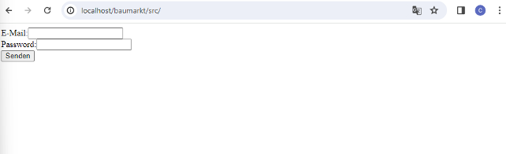
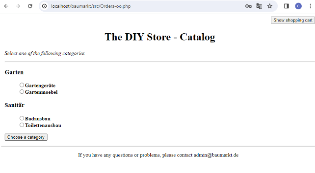
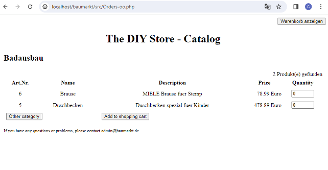
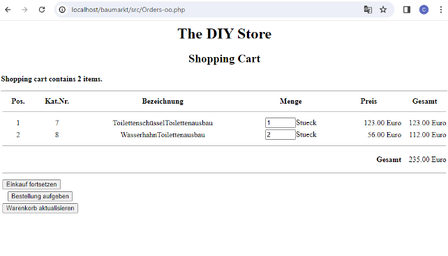

# Do-it-yourself Store

## :newspaper: About the project

It is a small projec to showcase following features when it comes to online shopping: Customer login, Selecting items from catalog, adding and deleting items from shopping cart and payment simulation.

### How it works

1. Install e.g. the [XAMPP](https://www.apachefriends.org/de/index.html)

2. Download the project from Github.

3. Insert the project in the `htdocs` folder.

4. From the `XAMPP Control Panel` start the `Apache` and `MySQL` module.

5. Run `localhost/guestbook/src/index.php` in a browser of your choice.

### Content overview

    .
    ├── images/ - visual studio code settings
    ├── src/ - code and data for tests
    ├── COPYRIGHT - project copyright
    ├── LICENSE - license text
    └── README.md - relevant information about the project

## :runner: Getting started

### Example output:

A. Login

B. Chosing items from a catalog

C. Adding and deleting items from the shopping cart

## :books: Resources used to create this project

* PHP
  * [php documentation](https://www.php.net/docs.php)
  * [PHP: Hypertext Processor](https://devdocs.io/php/)
* CSS
  * [CSS: Cascading Style Sheets](https://developer.mozilla.org/en-US/docs/Web/CSS?retiredLocale=de)
  * [CSS reference](https://devdocs.io/css/)
* SQL
  * [MySQL](https://dev.mysql.com/doc/)
* Markdwon
  * [Basic syntax](https://www.markdownguide.org/basic-syntax/)
  * [Complete list of github markdown emofis](https://dev.to/nikolab/complete-list-of-github-markdown-emoji-markup-5aia)
  * [Awesome template](http://github.com/Human-Activity-Recognition/blob/main/README.md)
  * [.gitignore file](https://git-scm.com/docs/gitignore)
* Editor
  * [Visual Studio Code](https://code.visualstudio.com/)

## :bookmark: License

This project is licensed under the terms of the [Creative Commons Attribution Share Alike 4.0 International](LICENSE).

## :copyright: Copyright

See the [COPYRIGHT](COPYRIGHT) file for copyright and licensing details.
