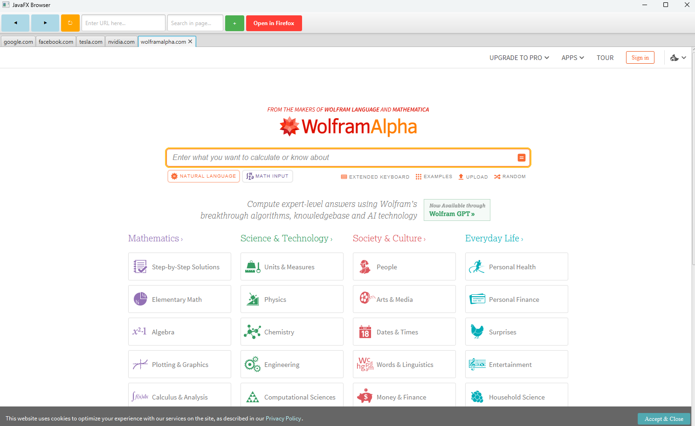

# JavaFX Browser Project

## :newspaper: About the project

This project is a simple yet powerful web browser application built using JavaFX. It offers a seamless browsing experience, allowing users to browse the web effortlessly, open multiple tabs for simultaneous browsing, navigate backward and forward with ease, refresh pages instantly to ensure the latest content, and enter URLs directly to visit specific websites. I use this browser daily, and it has significantly improved my web browsing efficiency and convenience. Whether you're a developer looking for a customizable browser or someone seeking a straightforward and effective web browsing tool, this project is designed to meet your needs.

## Features

* **Multi-Tab Browsing:** Open and manage multiple tabs effortlessly, allowing you to view and switch between several websites without losing context. This feature creates a smooth and organized browsing experience tailored for multitasking.

* **Enhanced Address Bar with Auto-Completion:** Quickly navigate to websites with our address bar that intuitively auto-completes URLs, including common prefixes (like “https://”) and domain extensions (e.g., “.com,” “.org”). This speeds up navigation and minimizes typing errors.

* **User-Friendly Navigation Controls:** Easily access and retrace your browsing path with forward and backward navigation buttons, so you can revisit or skip past pages in your browsing history with ease.

* **Quick Page Reload:** Refresh any open page with a single click to make sure you’re seeing the latest updates. This instant reload feature is designed for dynamic content and provides seamless updates without disrupting your browsing session.

* **Auto-Updating Tab Titles:** Manage multiple tabs efficiently with tabs that automatically show the title of each website. This dynamic titling keeps your tabs organized, letting you locate and switch between tabs effortlessly.

* **In-Page Text Search (Ctrl + F):** Search for specific content within a webpage with our in-page search function, accessible by pressing Ctrl + F. This lets you find and jump to exact phrases or keywords within seconds.

* **Open in External Browser:** For added flexibility, you can open any website in an external browser of your choice directly from the application, giving you control over your browsing environment and preferences.

* **Convenient Hotkeys for Tab Management (Ctrl + W):** Easily close tabs using the Ctrl + W shortcut, making it quick and simple to manage your open tabs and optimize your workflow.

* **Built-in Performance Profiling:** Monitor and improve browsing performance with integrated profiling tools, which provide insights into resource usage, enabling a smoother and more responsive browsing experience.

## Getting Started

1. Clone this repository to your local machine.

```sh
git clone https://github.com/CH6832/webbrowser-in-java.git
```

2. Open the project in your preferred IDE (e.g., IntelliJ IDEA, Eclipse).

3. Run the `BrowserApplication` class to start the application:



## Usage

1) Upon launching the application, a new tab will be opened with a default web page (e.g., Google).
2) To open a new tab, click the "+" button.
3) Enter a URL in the address bar and press Enter to navigate to the specified website.
4) Use the navigation buttons (Back, Forward, Refresh) to control navigation.
5) Close a tab by clicking the close button (X) on the tab.

## :books: Resources used to create this project

* Java
    * [Java Platform Standard Edition 22 Documentation](https://docs.oracle.com/en/java/javase/)
    * [JavaFX 17](https://openjfx.io/)
* Markdwon
    * [Basic syntax](https://www.markdownguide.org/basic-syntax/)
    * [Complete list of github markdown emofis](https://dev.to/nikolab/complete-list-of-github-markdown-emoji-markup-5aia)
    * [Awesome template](http://github.com/Human-Activity-Recognition/blob/main/README.md)
    * [.gitignore file](https://git-scm.com/docs/gitignore)
* Editor
    * [IntelliJ IDEA Community Edition](https://www.jetbrains.com/idea/download/?section=windows)

## :bookmark: License

This project is licensed under the terms of the [MIT License](LICENSE).

## :copyright: Copyright

See the [COPYRIGHT](COPYRIGHT) file for copyright and licensing details.
